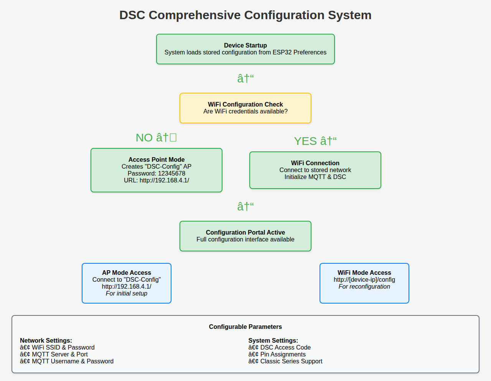

# DSC Comprehensive Configuration Portal

This document describes the enhanced configuration system that allows complete setup of the DSC Alarm Control system through a web interface, eliminating the need to modify source code.

## Overview

The enhanced configuration portal provides a comprehensive web-based interface to configure all aspects of the DSC system:

- **WiFi Network Settings** - Connect to your wireless network
- **MQTT Broker Configuration** - Set up Home Assistant or other MQTT integration  
- **DSC System Settings** - Configure access codes and alarm parameters
- **Pin Assignments** - Customize ESP32 GPIO pin connections
- **Dual Access Modes** - Available both during initial setup and normal operation

## Access Modes

### 1. Access Point (AP) Mode - Initial Setup
When the device has no WiFi configuration or cannot connect to the stored network:

- **Network Name:** `DSC-Config`
- **Password:** `12345678`  
- **URL:** `http://192.168.4.1/`
- **Purpose:** Initial device configuration

### 2. WiFi Mode - Reconfiguration
When connected to your WiFi network:

- **URL:** `http://[device-ip]/config`
- **Purpose:** Update configuration without losing connection
- **Features:** Shows current connection status and allows incremental updates

## Configuration Parameters

### WiFi Network Settings
- **SSID:** Your wireless network name
- **Password:** Your wireless network password
- **Validation:** Required fields for initial setup
- **Current Status:** Displays currently connected network

### MQTT Broker Settings
- **Server/IP:** MQTT broker hostname or IP address (e.g., `mqtt.home.local`, `192.168.1.100`)
- **Port:** MQTT broker port (default: 1883)
- **Username:** Optional authentication username
- **Password:** Optional authentication password
- **Current Status:** Shows connection status to MQTT broker

### DSC System Settings  
- **Access Code:** Your DSC panel access code (required for disarm operations)
- **Purpose:** Used for disarming alarms and some arming operations
- **Security:** Stored securely in ESP32 flash memory

### ESP32 Pin Assignments
Configure GPIO pins for DSC interface connections:

- **Clock Pin (Yellow Wire):** Default 18, valid range 4-39
- **Data Read Pin (Green Wire):** Default 19, valid range 4-39  
- **Data Write Pin (Virtual Keypad):** Default 21, range 4-33 (set to 0 to disable)
- **PC16 Pin (Classic Series):** Default 17, range 4-39 (DSC Classic series only)

## Features

### Smart Configuration Management
- **Persistent Storage:** All settings saved in ESP32 Preferences (non-volatile)
- **Incremental Updates:** Only modify settings you want to change
- **Current Value Display:** Shows existing configuration for reference
- **Validation:** Required field checking and range validation

### User Experience
- **Responsive Design:** Works on desktop and mobile devices
- **Sectioned Interface:** Organized by configuration category
- **Status Information:** Real-time connection status display
- **Clear Instructions:** Helpful descriptions for each setting

### Safety and Reliability  
- **Automatic Fallback:** Returns to AP mode if WiFi connection fails
- **Configuration Backup:** Previous settings preserved during updates
- **Restart Management:** Controlled restart sequence after configuration changes
- **Error Handling:** Clear error messages for invalid configurations

## Usage Instructions

### Initial Setup (First Time)
1. Flash the firmware to your ESP32 device
2. Power on the device 
3. Look for "DSC-Config" WiFi network on your phone/computer
4. Connect using password: `12345678`
5. Open browser to `http://192.168.4.1/`
6. Fill in all required configuration fields
7. Click "Save Configuration and Restart"
8. Device will restart and connect to your WiFi network

### Reconfiguration (After Setup)
1. Find your device's IP address (check your router or serial monitor)
2. Open browser to `http://[device-ip]/config`
3. Update any settings you want to change
4. Leave fields blank to keep existing values
5. Click "Save Configuration and Restart"
6. Device will restart with new configuration

## Technical Implementation

### Configuration Storage
- Uses ESP32 `Preferences` library for persistent storage
- Namespace: `"config"` 
- Individual keys for each parameter (ssid, password, mqttServer, etc.)
- Survives power cycles and firmware updates

### Dynamic Initialization
- DSC interface created dynamically based on stored pin configuration
- MQTT client initialized with stored broker settings
- Pin assignments applied at runtime rather than compile time

### Web Server Architecture
- Single web server handles both AP and WiFi modes
- Different endpoints for different access modes (`/` for AP, `/config` for WiFi)
- Separate save handlers with appropriate validation
- Graceful error handling and user feedback

## Troubleshooting

### Cannot Access Configuration Portal
- **AP Mode:** Ensure you're connected to "DSC-Config" network
- **WiFi Mode:** Verify device IP address and network connectivity
- **Check Serial Output:** Monitor serial console for startup messages

### Configuration Not Saving
- **Check Required Fields:** WiFi SSID, MQTT Server, and Access Code are required
- **Restart After Save:** Device must restart for changes to take effect
- **Network Issues:** Ensure stable connection during configuration save

### Connection Problems After Configuration
- **WiFi Issues:** Device returns to AP mode automatically if WiFi fails
- **MQTT Issues:** Check server address, port, and credentials
- **DSC Issues:** Verify pin assignments and physical connections

### Reverting Configuration
- **WiFi Manager:** Will automatically start AP mode if connection fails
- **Serial Access:** Monitor serial output for configuration status
- **Factory Reset:** Clear preferences by uploading fresh firmware

## Integration Notes

### Home Assistant
- MQTT topics remain unchanged from original implementation
- Configuration portal adds convenience without breaking existing integrations
- All Home Assistant automations and entities continue to work

### Development and Testing
- Configuration can be modified without reflashing firmware
- Easy to test different MQTT brokers and settings
- Pin assignments can be changed for different hardware layouts

## Security Considerations

- **Access Code Storage:** Stored in ESP32 flash, not transmitted over network
- **WiFi Password:** Transmitted over local connection only
- **MQTT Credentials:** Stored locally, use secure MQTT broker setup
- **Network Isolation:** AP mode creates isolated configuration environment