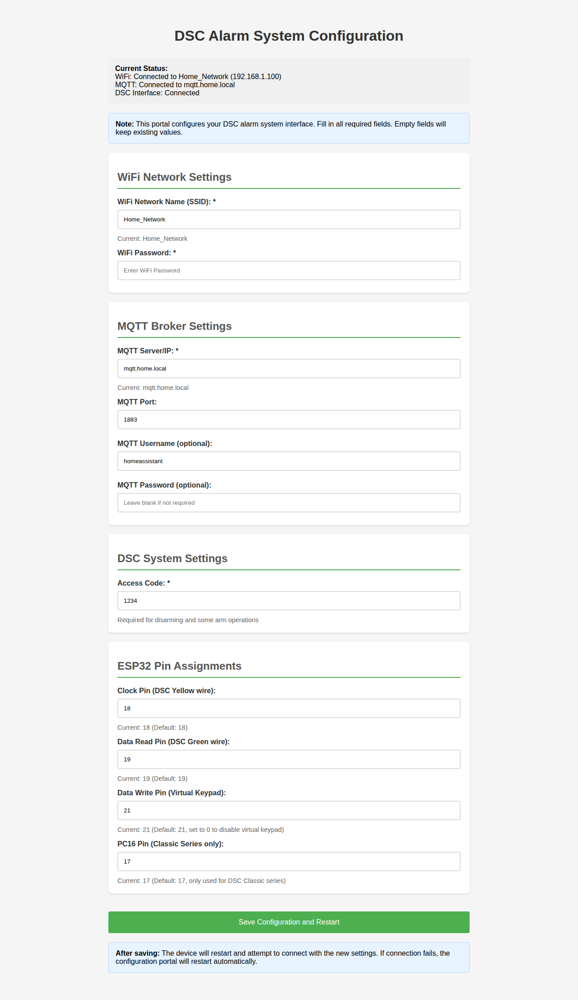

# DSC Keybus Interface Examples

This directory contains example sketches for the DSC Keybus Interface library with **Comprehensive Configuration Portal** functionality.

## 🚀 Comprehensive Configuration Portal

**NEW!** All examples now include a complete web-based configuration system. **No code modification required** for any settings!

### ✨ What's Configurable
- **WiFi Network** - SSID and password
- **MQTT Broker** - Server, port, username, password  
- **DSC System** - Access codes and alarm settings
- **Pin Assignments** - All ESP32 GPIO connections
- **Access Modes** - Available in both AP and WiFi modes



### Quick Start
1. Flash any example to your ESP32
2. Power on the device
3. Connect to "DSC-Config" access point (password: `12345678`)
4. Open http://192.168.4.1 in your browser  
5. Configure ALL settings through the web interface
6. Save and restart - device connects with full configuration

### Reconfigure Anytime
- Access http://[device-ip]/config when connected to WiFi
- Update any settings without losing connection
- No need to reflash firmware or edit code

📖 **[Complete Documentation](../CONFIGURATION_PORTAL.md)**

---

## Examples

### HomeAssistant-MQTT
MQTT integration for Home Assistant with comprehensive configuration.
- **Path**: `esp32/HomeAssistant-MQTT/HomeAssistant-MQTT.ino`
- **Features**: Full web configuration, MQTT publishing, Home Assistant integration  
- **Configuration**: Everything configurable via web portal - no code changes needed

#### VirtualKeypad-Web  
Web-based virtual keypad interface with integrated WiFi configuration.
- **Path**: `esp32/VirtualKeypad-Web/VirtualKeypad-Web.ino`
- **Features**: WiFi Manager, WebSocket interface, virtual keypad controls
- **Configuration**: WiFi via web portal, access keypad at device IP

### Advanced Configuration

For developers who prefer hardcoded credentials, you can still set them in the sketch:

```cpp
const char* wifiSSID = "YourNetworkName";
const char* wifiPassword = "YourPassword";
```

The device will try hardcoded credentials first, then fall back to the web configuration if they fail.

### Troubleshooting

**Device not connecting to WiFi:**
1. Connect to "DSC-Config" network
2. Check that you entered the correct WiFi credentials
3. Ensure your WiFi network is 2.4GHz (ESP32 doesn't support 5GHz)
4. Check WiFi signal strength

**Can't find "DSC-Config" network:**
1. Wait 30-60 seconds after powering on
2. Check serial monitor for status messages
3. Try powering off/on the device

**Need to change WiFi credentials:**
1. Connect to serial monitor
2. The device will fall back to configuration mode if WiFi fails
3. Or clear saved credentials by uploading fresh firmware